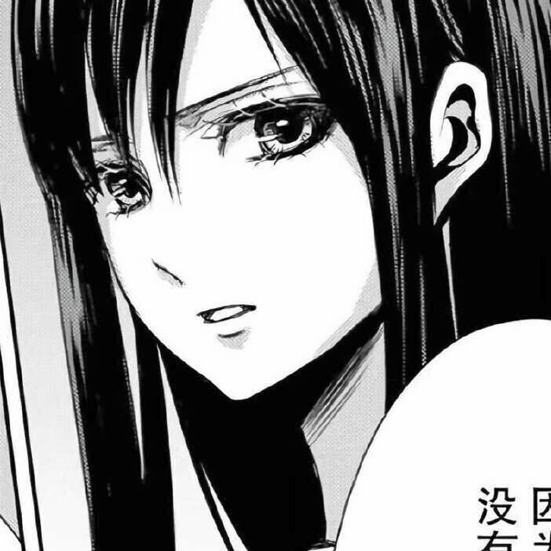

  

 

<table>
  <tr>
    <td width="62%" valign="top">
      <h2>Hi, I'm Kizy</h2>
      

        A college student majoring in <b>Blockchain Engineering</b>, with a strong interest in
        <b>Web3</b>, <b>AI development</b>, creative tools, and product design.
      

      

        I write notes and articles at
        <a href="https://kizzy899.github.io/">kizzy899.github.io</a>, and I am currently studying at
        <b>CUIT</b>.
      

      

        Reach me at <a href="mailto:eightjiu899@gmail.com">eightjiu899@gmail.com</a>
      

    </td>
    <td width="38%" align="center">
      
    </td>
  </tr>
</table>

### Connect

  
  
  

### Languages and Tools

  

### GitHub Stats

  
  

<picture>
  <source media="(prefers-color-scheme: dark)" srcset="./dist/github-snake-dark.svg" />
  <source media="(prefers-color-scheme: light)" srcset="./dist/github-snake.svg" />
  
</picture>
